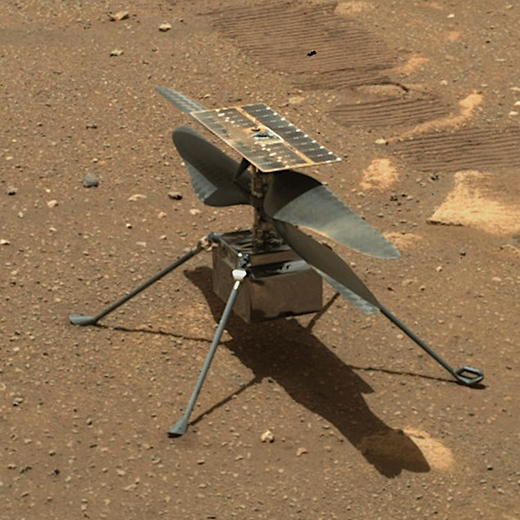

Interests
=========

A place for developers to share their interests! ✨

Ingenuity
---------

- **Ingenuity** is a small robotic solar helicopter operating on Mars as part of
  NASA's Mars 2020 mission. On 19 April 2021, it successfully completed the first
  powered controlled flight by an aircraft on a planet besides Earth, taking off
  vertically, hovering and landing [`1`_].

.. _`1`: https://en.wikipedia.org/wiki/Ingenuity_(helicopter)

